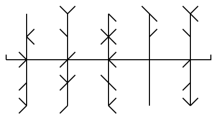

# Hand-Drawn-Barcode

This repository is related to the [master thesis "A Hand-Drawn Barcode"](http://dx.doi.org/10.13140/RG.2.2.27264.87046), submitted in partial fulfillment of the requirements for the degree of "Master in Artificial Intelligence and Depp Learning" at the University of Alcalá by Daniel Klöck on October 2020.

It contains:
* [Hand-Drawn Barcodes Dataset](./Hand-Drawn%20Barcodes%20Dataset): A dataset of cleaned annotated images of hand-drawn barcodes, collected using the ["Hand-drawn Barcode User Study" webpage](https://barcode-dataset-generator.herokuapp.com/) between August 27th and 31st 2020.
* [Extracted and Augmented Bars](./Extracted%20and%20Augmented%20Bars): A collection of extracted bars, augmented by mirroring horizontally, vertically and both.
* [Chapter2](./Chapter2): Notebooks related to the second chapter, which discusses the generation of a barcode that can be hand-drawn.
* [Chapter3](./Chapter3): Notebooks, configuration files and example result images related to the third chapter, which defines a process to recognize such a barcode, trains the necessary models and evaluates them.
* [Chapter4](./Chapter4): Notebooks related to the forth chapter, which proposes encoding and deconding mechanisms while evaluating error probabilities.

## Contact

Questions and comments can be sent to kloeck[at]pappuga[dot]com